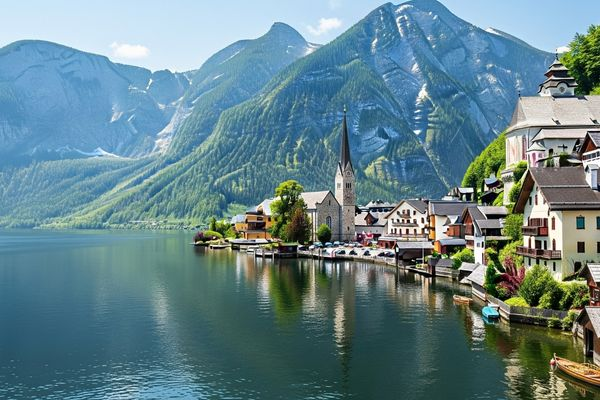
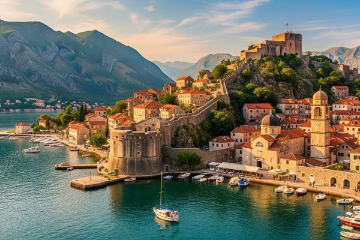
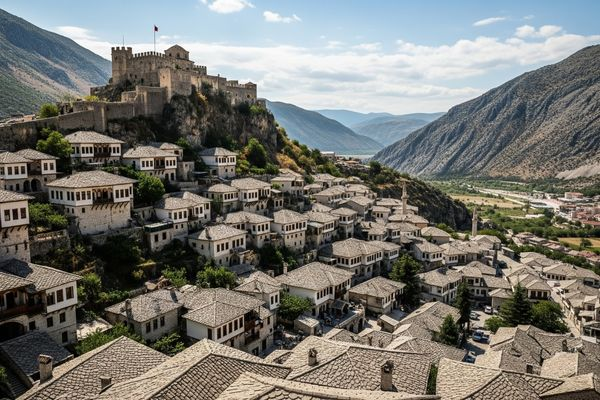
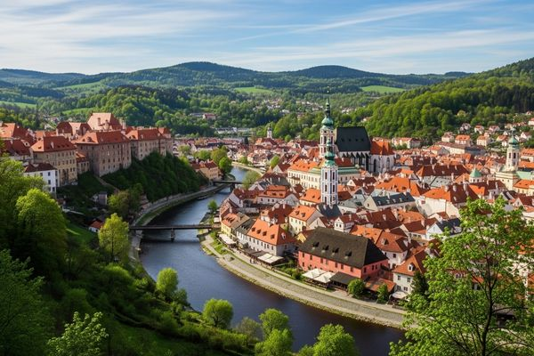
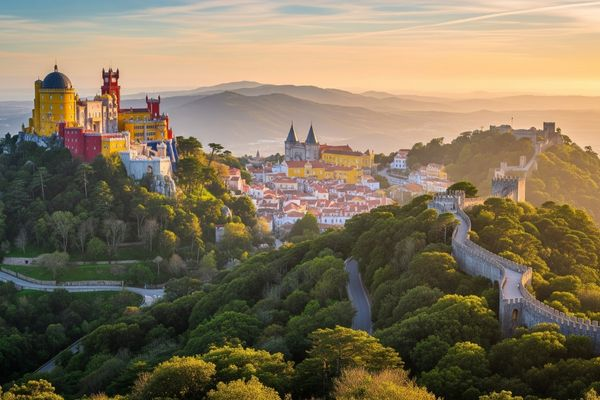
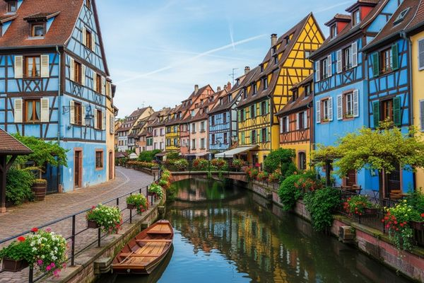
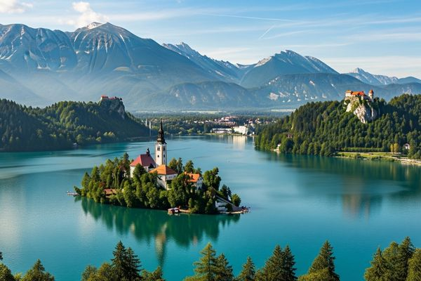
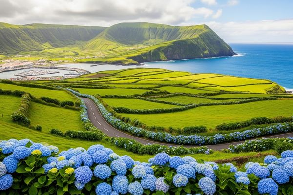

When most people think of Europe, iconic capitals like Paris, Rome, and London immediately come to mind. But beyond the famous landmarks, the continent hides countless magical destinations waiting to be discovered. For travelers seeking authenticity away from the crowds, here are the top hidden gems to explore in 2025.

---

## 1. Hallstatt, Austria  

Nestled between mountains and a crystal-clear lake, this fairy-tale village offers postcard-perfect scenery. A boat ride in autumn, surrounded by vibrant colors, is simply unforgettable.  
👉 **Tip:** Don’t miss the historic salt mine tour and climb to the Skywalk for panoramic views.

---

## 2. Kotor, Montenegro  

Located on the Adriatic coast, Kotor is a budget-friendly alternative to Venice with its medieval walls and stunning bay. Climb the fortress early in the morning to catch a breathtaking sunrise.  
👉 **Best Time to Visit:** Spring (April–May) for mild weather and fewer crowds.

---

## 3. Gjirokastër, Albania  
A UNESCO World Heritage site, this town enchants visitors with its stone houses and authentic Balkan atmosphere, making you feel like you’ve traveled back in time.  
👉 **Must-See:** The hilltop fortress and its sweeping views over the Drino Valley.

---

## 4. Český Krumlov, Czech Republic  
A peaceful alternative to Prague, this medieval town charms with winding streets, a stunning castle, and riverside views.  
👉 **Don’t Miss:** A rafting trip on the Vltava River for a unique perspective of the town.

---

## 5. Sintra, Portugal  
Just outside Lisbon, Sintra is a dreamy land of palaces, gardens, and mystic vibes. The colorful Pena Palace looks straight out of a storybook.  
👉 **Traveler’s Tip:** Arrive early in the morning to avoid long queues at popular sites.

---

## 6. Colmar, France  
Nicknamed “Little Venice,” this colorful Alsatian town feels like a movie set. With canals and half-timbered houses, it’s a photographer’s paradise.  
👉 **Extra Tip:** Try the local Alsatian wines and explore the Christmas market if you visit in winter.

---

## 7. Bled, Slovenia  
Famous for its emerald-green lake and charming island church, Bled is the epitome of natural beauty. Hop on a traditional *Pletna* boat to reach the island.  
👉 **Adventure Idea:** Hike to Ojstrica viewpoint for the best panorama of Lake Bled.

---

## 8. Faial Island, Azores (Portugal)  
A paradise for nature lovers, Faial offers volcanic landscapes, whale watching, and serene hiking trails.  
👉 **Highlight:** Don’t miss the Capelinhos Volcano, which last erupted in 1957 and reshaped the island.

---

✨ **Travel Tip:** Compared to crowded capitals, these destinations are not only more affordable but also provide a more authentic cultural experience. Perfect for travelers wanting unforgettable memories in 2025.  

✈️ **Plan Your Trip**  

- 🏨 Find hotels, apartments, and cozy stays on [Booking.com](https://booking.tpk.mx/J4JxTDNK)  
- ✈️ Compare flights, book hotels, and organize tours in one place with [Trip.com](https://trip.tpk.mx/pkmHWLTS)

*This post may include affiliate links that support our free content at no extra cost to you.*  

👉 Ready to plan your unforgettable 2025 journey? Add these hidden gems to your travel bucket list and start your adventure today! Don’t forget to comment below which destination excites you the most.  
